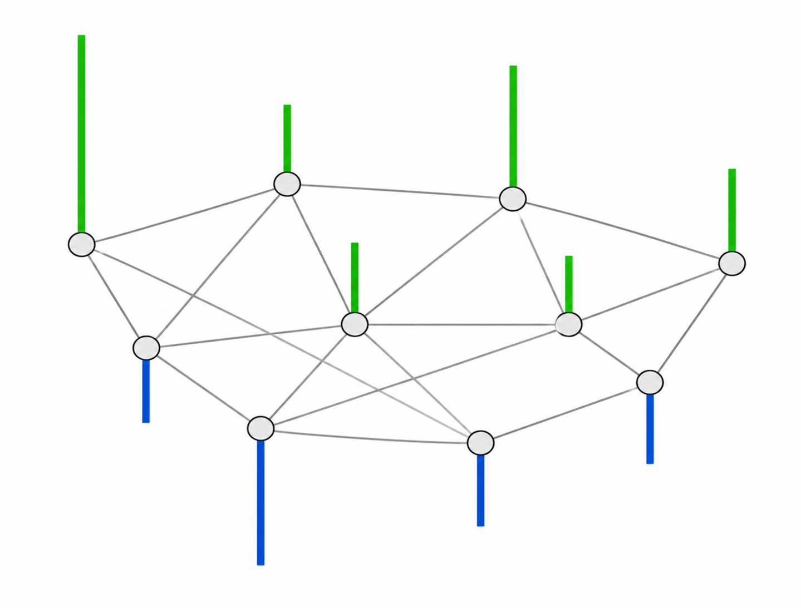

<!-- markdownlint-disable -->

# Overview

This repository contains work on binary classification of graph-structured data using graph-based spectral decomposition and a generalized likelihood ratio test (GLRT). This approach is based on prior research by Hu et al. (["Matched signal detection on graphs: theory and application to brain imaging data classification"](https://doi.org/10.1016/j.neuroimage.2015.10.026), *NeuroImage*, 2016), in which signals are analyzed in graph Fourier bases derived from class-specific graph Laplacians.
<!-- , which explores classification of graph signals by comparing how well they align with the low-frequency graph Fourier components of class-specific reference graphs.  -->

In this project, I implement the GLRT rule in the bandlimited graph-signal setting and apply it to Alzheimer's disease detection from PET images. Each brain region corresponds to a graph node and is described by a linear combination of five statistical features following the design proposed by Garali et al. (["Region-based brain selection and classification on PET images for Alzheimer's disease computer aided diagnosis"](https://doi.org/10.1109/ICIP.2015.7351045), IEEE International Conference on Image Processing, 2015).

This work was carried out during my engineering studies at Centrale Méditerranée in collaboration with Fresnel Institute.

 

  
   
  Brain representation as a graph, whose nodes and edge weights correspond to different regions and the connectivity between those regions, respectively. 

 

# Data

The file "subjects_data.mat" contains statistical features extracted from 142 segmented brain FDG-PET images. These images were provided by La Timone Hospital (Marseille) and correspond to 61 healthy control subjects and 81 patients with Alzheimer's disease. Each brain image was segmented into 116 regions of interest (ROIs) using WFU-PickAtlas. For each region, the first four moments (mean, variance, skewness, and kurtosis) and the entropy were computed. The resulting data are stored as two tensors of size 116 × 5 × *N*, where *N* denotes the number of subjects in each class: healthy control or Alzheimer’s disease.

# Methods

The classification pipeline can be run using the file "classification_main.m". 

First, for each class, we construct a representative graph whose nodes represent brain regions. These graphs are undirected and complete. Each region's 5D feature vector is reduced to a scalar value by taking a linear combination with coefficients $\alpha \in \mathbb{R}^5$. Edge weights are computed using a Gaussian kernel to reflect similarity between regions.

 

  
   
  Example of a graph signal, with positive and negative values shown as green and blue bars, respectively. In this project, the scalar value associated with each node is derived from regional PET image features. For readability, this illustration shows a sparse graph; the graphs used in this work are fully connected (i.e., complete) and undirected. 

 

Under the bandlimited graph-signal assumption, the underlying noiseless signal corresponding to the input is expected to lie mostly in the low-frequency subspace of the graph associated with its true class. Higher-frequency components are treated as additive, white, zero-mean Gaussian noise. Using an equal-prior GLRT decision rule, the input signal is assigned to the class whose graph Fourier basis yields the largest low-frequency projection energy.

# Results

The classifier is evaluated using a leave-one-out procedure with the first *K*=3 graph-Laplacian eigenvectors (ordered by increasing eigenvalue) for each class. The positive class corresponds to patients with Alzheimer's disease. The five features in the coefficient vector $\alpha$ are ordered as: mean, variance, skewness, kurtosis, and entropy.

| Linear feature combination | Coefficients $\alpha$ | Sensitivity | Specificity | F1 score |
|---|---|---:|---:|---:|
| Equal weighting of all five features | $(0.2, 0.2, 0.2, 0.2, 0.2)$ | 0.91 | 0.69 | 0.85 |
| Mean/variance-focused weighting | $(0.5, 0.5, 0.0, 0.0, 0.0)$ | 0.67 | 0.95 | 0.78 |

These results suggest that simple linear combinations of the five regional statistics can already produce meaningful classification behavior, with different trade-offs between sensitivity and specificity.

# Further reading

A blog article providing more technical details and context is available here:
["Graph-structured data classification based on spectral methods and the generalized likelihood ratio test"](https://pohl-michel.github.io/blog/articles/fourier-glrt-graph-classification/article.html).

# Acknowledgements

This work was conducted in collaboration with Fresnel Institute under the supervision of Mouloud Adel. Image processing, including tensor construction and statistical feature design, was conducted by Imène Garali. Further tensor-data exploration and preprocessing were initially conducted together with Yassine Zniyed and Kaoutar Abdelalim.