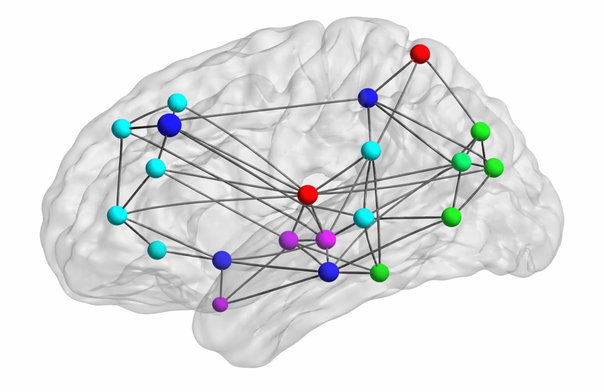

<!-- markdownlint-disable -->

# Overview

This repository contains work on binary classification of graph-structured data using spectral graph methods and a generalized likelihood ratio test (GLRT). This approach is based on prior research from Hu et al. (["Matched signal detection on graphs: Theory and application to brain imaging data classification"](https://doi.org/10.1016/j.neuroimage.2015.10.026), NeuroImage, 2016), where signals are analyzed in graph Fourier bases derived from class-specific graph Laplacians.
<!-- , which explores classification of graph signals by comparing how well they align with the low-frequency graph Fourier components of class-specific reference graphs.  -->

In this project, I implement the GLRT rule in the bandlimited graph-signal setting and apply it to Alzheimer's disease detection from PET images. Each brain region corresponds to a graph node and is described by a linear combination of five relevant statistical features following the design proposed by Garali et al. (["Region-based brain selection and classification on pet images for Alzheimer's disease computer aided diagnosis"](https://doi.org/10.1109/ICIP.2015.7351045), International Conference on Image Processing, 2015).

 This project was carried out during my engineering studies at [Centrale Méditerranée](https://www.centrale-mediterranee.fr/en) in collaboration with [Fresnel Institute](https://www.fresnel.fr/wp/en/). The full technical report in French is available [here](graph_classification_report_french_2016.pdf), and the corresponding blog article in English can be accessed [here](https://pohl-michel.github.io/blog/articles/fourier-glrt-graph-classification/article.html).

 

  
   
  Brain representation as a graph whose nodes and edge weights correspond to different regions and the connectivity between those regions, respectively. 

 

# How to reference

If you reuse this report, figures, or code, please reference:

Michel Pohl, *Aide au diagnostic de la maladie d'Alzheimer par une méthode de graph matching*, technical report, Centrale Méditerranée, 2016.

Note: Work conducted in collaboration with Fresnel Institute under the supervision of Mouloud Adel.